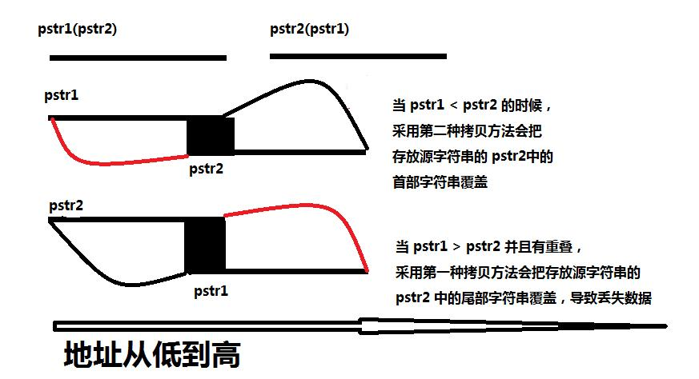

## 数组和指针的区别是什么，什么时候数组会退化为指针

| 指针                                                         | 数组                                            |
| ------------------------------------------------------------ | ----------------------------------------------- |
| 保存数据的地址                                               | 保存数据                                        |
| 间接访问数据，首先取得指针的内容，把它作为地址，然后从这个地址提取数据；如果指针有一个下标[I],就把指针的内容加上I作为地址，从中取得数据。 | 直接访问数据，a[I]就是简单的以a+I为地址取得数据 |
| 通常用于动态数据结构                                         | 通常用于存储固定数目且数据类型相同的元素        |
| 相关的函数为`malloc()`, `free()`                             | 隐式分配和删除                                  |
| 通常指向匿名数据                                             | 自身即为数据名                                  |

定义指针时，编译器并不为指针指向的对象分配空间，只是分配指针本身的空间，除非在定义时同时赋给指针一个字符串常量进行初始化，初始化指针时所创建的字符串常量被定义为只读，不能修改。

与指针相反，由字符串常量初始化的数组是可以修改的。

##### 什么时候数组和指针是相同的

- 表达式中的数组名（与声明不同），被编译器当作一个指向该数组第一个元素的指针

  对数组下标的引用可以理解成一个指向数组起始地址的指针加上偏移量

  ```C
  int a[10], *p , i = 2;
  //可以通过以下任何一种方法来访问a[i]
  p = a;
  *(p + i);
  
  p = a + i;
  *p;
  ```

- 下标与指针的偏移量相同

- 在函数参数的声明中，数组名被编译器当做指向该数组第一个元素的指针

##### 下列情况下，对数组的引用不能用指向该数组第一个元素的指针来替代

- 数组作为sizeof()的操作数，此时需要的是整个数组的大小，而不是指针所指向的第一个元素的大小
- 使用&操作符取数组的地址
- 数组是一个字符串常量初始值

## 实现memcpy,考虑内存重叠(memmove)

```C
void *memcpy(void *dest, const void *src, size_t n) {
    assert(dest && src);

    char *pdest = (char *)dest;
    char *psrc = (char *)src;

    //当pdest< psrc时，即pdest的首地址小于psrc的首地址（图1），正序拷贝
    if (pdest < psrc) {
        for (size_t i = 0; i < n; ++i) {
            *pdest = *psrc;
            ++pdest;
            ++psrc;
        }
    } else {
    //当pdest> psrc时，即pdest的首地址大于psrc的首地址（图2），倒叙拷贝
        pdest += n - 1;
        psrc += n - 1;
        for (size_t i = 0; i < n; ++i) {
            *pdest = *psrc;
            --pdest;
            --psrc;
        }
    }
    return dest;
}
```



