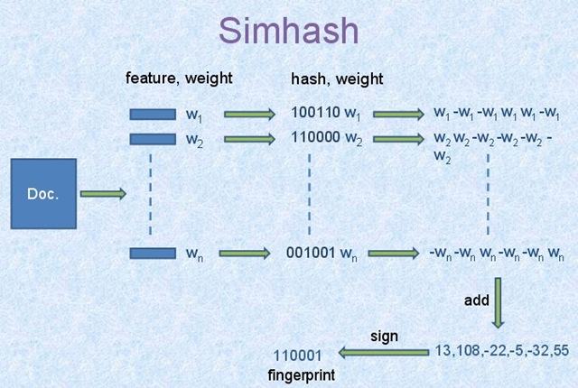

# 搜索引擎

## 离线模块

建立网页库, 保存到文件中, 生成倒排索引, 将去重后的网页库和倒排索引保存到文件中

#### simhash

1. 将Doc进行关键词抽取(其中包括分词和计算权重)，抽取出n个(关键词，权重)对， 即图中的`(feature, weight)`们。 记为 `feature_weight_pairs` = [fw1, fw2 … fwn]，其中 fwn = (`feature_n`,`weight_n`)。
2. `hash_weight_pairs` = [ (hash(feature), weight) for feature, weight in `feature_weight_pairs` ] 生成图中的`(hash,weight)`们, 此时假设hash生成的位数`bits_count = 6`（如图）, 使用hash算法生成一个bits_count位的散列值;
3. 然后对 `hash_weight_pairs` 进行位的纵向累加，如果该位是1，则`+weight`,如果是0，则`-weight`，最后生成`bits_count`个数字，如图所示是`[13, 108, -22, -5, -32, 55]`, 这里产生的值和hash函数所用的算法相关。
4. `[13,108,-22,-5,-32,55] -> 110001`这个就很简单啦，正1负0,  最终`110001`就是该文本的二进制签名

#### 建立倒排索引

倒排索引：英文原名为Inverted index，大概因为 Invert 有颠倒的意思，就被翻译成了倒排。一个未经处理的网页库中，一般是以文档ID作为索引，以文档内容作为记录。而Inverted index 指的是将单词或记录作为索引，将文档ID作为记录，这样便可以方便地通过单词或记录查找到其所在的文档。

在此项目中，倒排索引的数据结构采用的是:

`unordered_map <string, vector<pair<int, double>>> InvertIndexTable`

其中unordered_map的key为出现在文档中的某个词语，对应的value为包含该词语的文档ID的集合以及该词语的权重值w。

建倒排索引时最难的是每个词语的权重值的计算，它涉及到如下几个概念：

 `TF : Term Frequency`, 某个词在文章中出现的次数；

 `DF: Document Frequency`, 某个词在所有文章中出现的次数，即包含该词语的文档数量；

 `IDF: Inverse Document Frequency`, 逆文档频率，表示该词对于该篇文章的重要性的一个系数，其计算公式为：`IDF = log2(N/(DF+1))`，其中N表示文档的总数或网页库的文档数

最后，词语的权重w则为：`w = TF * IDF`

可以看到权重系数与一个词在文档中的出现次数成正比，与该词在整个网页库中的出现次数成反比。

而一篇文档包含多个词语w1,w2,...,wn，还需要对这些词语的权重系数进行归一化处理，其计算公式如下：

 `w' = w /sqrt(w1^2 + w2^2 +...+ wn^2)`

 w'才是需要保存下来的，即倒排索引的数据结构中InvertIndexTable的double类型所代表的值。此权重系数的算法称为`TF-IDF`算法

## 在线模块

Reactor: IO线程

线程池:   计算线程 

计算线程要通知IO线程发送数据

网络编程过程中涉及到三个半事件

- 当新连接到来时,  onConnection 
- 当消息到达时,    onMessage
- 当连接关闭时,    onClose

#### 程序的运行步骤

1. 初始化配置类，读取网页库、倒排索引，启动线程池。
2. 通过配置对象，获取ip地址和端口号，启动TCP服务器，循环监听并接受客户端发来的查询请求。此监听线程为**IO线程**，负责与客户端的通信。
3. 只要一有请求，就根据请求创建一个任务对象Task，同时线程池把该任务放到任务队列中去，交给一个**计算线程**进行处理。
4. 当**计算线程**处理完任务后，会将返回结果封装成一个Json数据，并将该数据交给**IO线程**来发送给客户端。

#### 计算线程工作流程

1. 初始化自己的内存cache对象。
2. 循环不停地去任务队列里取任务 。
3. 执行任务
4. 调用成员函数doQuery()获得查询结果。在doQuery()中，先检查客户端发来的请求是否在cache中，如果在则直接从cache中把结果返回。如果不在chache中，根据先前建立的索引进行查询。
5. 当执行完查询之后，将结果返回给客户端，同时存储到cache中去。

#### 100G的xml文件(就是想表达内存存不下)，只允许使用单台服务器，不允许出现停机更新的情况，同时要做到搜索结果的实时性，我的项目要怎么改进

## 项目的完整流程以及详细实现