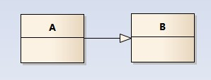

## 类与类之间有哪些关系? 各自有什么特点？

- 继承（泛化）：

  A is B

  多态

  泛化关系用一条带空心箭头的直接表示；如下图表示（A继承自B）

  最终代码中，泛化关系表现为继承非抽象类

  

- 组合：

  UML：用一条带实心菱形箭头直线表示，如下图表示A组成B，或者B由A组成

  A has B

  整体和局部：整体部分负责局部对象的销毁

  作为数据成员：对象成员

  

- 聚合：

  UML：用一条带空心菱形箭头的直线表示，如下图表示A聚合到B上，或者说B由A组成

  比较强的一种关联关系

  对象之间的关系表现为整体和局部

  整体部分并不负责局部对象的销毁

  作为数据成员：指针或引用

  

- 关联：

  UML:用一条直线表示的；它描述不同类的对象之间的结构关系；它是一种静态关系， 通常与运行状态无关，一般由常识等因素决定的；它一般用来定义对象之间静态的、天然的结构； 所以，关联关系是一种“强关联”的关系;

  比如，乘车人和车票之间就是一种关联关系；学生和学校就是一种关联关系；

  关联关系默认不强调方向，表示对象间相互知道；如果特别强调方向，如下图，表示A知道B，但 B不知道A;

  关系是固定的(A has B)

  彼此并不负责对方的生命周期

  一般使用指针或引用

  

- 依赖：

  UML:用一套带箭头的虚线表示的；如下图表示A依赖于B；他描述一个对象在运行期间会用到另一个对象的关系;

  与关联关系不同的是，它是一种临时性的关系，通常在运行期间产生，并且随着运行时的变化； 依赖关系也可能发生变化；

  显然，依赖也有方向，双向依赖是一种非常糟糕的结构，我们总是应该保持单向依赖，杜绝双向依赖的产生；

  注：在最终代码中，依赖关系体现为类构造方法及类方法的传入参数，箭头的指向为调用关系；依赖关系除了临时知道对方外，还是“使用”对方的方法和属性；

  从语义上来说是 A use B，是偶然的，临时的，并非固定的

  通过函数来表现

  B作为A的成员函数参数

  B作为A的成员函数的局部变量

  A的成员函数调用B的静态方法

  


## 面向对象设计原则有哪些？各自的特点是什么？

- 单一职责原则(Single Responsibility Principle)

  解耦和增强内聚性。一个类，最好只做一件事，只有一个引起它变化的原因

- 开放闭合原则(Open Closed Principle)

  软件实体(类,模块,函数等等)应当对扩展开放，对修改闭合。

  核心思想就是对抽象编程，而不对具体编程，因为抽象相对稳定。让类依赖于固定的抽象，所以修改就是封闭的；而通过面向对象的继承和多态机制，又可以实现对抽象类的继承，通过覆写其方法来改变固有行为，实现新的拓展方法，所以就是开放的。

- 里氏替换原则(Liscov Substitution Principle)

  派生类必须能够替换其基类。

  实现的方法是面向接口编程：将公共部分抽象为基类接口或抽象类，通过提取抽象类，在子类中通过覆写父类的方法实现新的方式支持同样的职责

- 接口分离原则(Interface Segregation Principle)

  避免使用“胖”接口，使用多个小的专门的接口，而不要使用一个大的总接口

- 依赖倒置原则(Dependency Inversion Principle)

  面向接口编程，依赖于抽象

  当两个模块之间存在紧密的耦合关系时，最好的方法就是分离接口和实现：在依赖之间定义一个抽象的接口使得高层模块调用接口，而底层模块实现接口的定义，以此来有效控制耦合关系，达到依赖于抽象的设计目标。

## 设计模式有哪些？

| 创新型设计模式   | 结构型设计模式 | 行为型设计模式 |
| ---------------- | -------------- | -------------- |
| **单例模式**     | **适配器模式** | 职责链模式     |
| 简单工厂模式     | 桥接模式       | 命令模式       |
| **工厂方法模式** | 装饰模式       | 解释器模式     |
| **抽向工厂模式** | 组合模式       | 迭代器模式     |
| 原型模式         | 外观模式       | 中介者模式     |
| 建造者模式       | 享元模式       | 备忘录模式     |
|                  | **代理模式**   | **观察者模式** |
|                  |                | 状态模式       |
|                  |                | 策略模式       |
|                  |                | 模板方法模式   |
|                  |                | 访问者模式     |

## 实现工厂模式

前提条件:

1. 针对于复杂对象
2. 批量创建对象

对于简单对象，不适合使用工厂模式
抽象工厂： 一个工厂生产多种系列的产品

```c++
#include <math.h>
#include <iostream>
#include <memory>
using std::unique_ptr;
using std::cout;
using std::endl;

class Figure {
public://提供统一的接口
	virtual void display() const =0;
	virtual double area() const=0;

	virtual
	~Figure() { cout << "~Figure()" << endl;	}
};

void display(Figure * fig) {
	fig->display();
	cout << "的面积是:" << fig->area() << endl;
}

class Rectangle
: public Figure {
public:
	Rectangle(double length, double width)
	: _length(length)
	, _width(width)
	{
		cout << "Rectangle()" << endl;
	}

	void display() const
	{
		cout << "rectangle";
	}

	double area() const
	{	
		return _length * _width;
	}
private:
	double _length;
	double _width;
};


class Circle
: public Figure {
public:
	Circle(double radius)
	: _radius(radius)
	{
		cout << "Circle()" << endl;
	}

	void display() const
	{	cout << "circle";	}

	double area() const
	{
		return 3.14159 * _radius * _radius;
	}

private:
	double _radius;
};

class Triangle
: public Figure {
public:
	Triangle(double a, double b, double c)
	: _a(a)
	, _b(b)
	, _c(c)
	{
		cout << "Triangle()" << endl;
	}

	void display() const
	{
		cout << "triangle";
	}

	double area() const
	{
		double p = (_a + _b + _c)/2;
		return sqrt(p * (p - _a) * (p - _b) * (p - _c));
	}

private:
	double _a;
	double _b;
	double _c;
};

class Factory {
public:
    virtual Figure* create() = 0;
    virtual ~Factory() { cout << "~Factory()" << endl; }
};

class RectangleFactory :public Factory {
public:
    Figure* create() {
        return new Rectangle(2, 3);
    }
};

class CircleFactory :public Factory {
public:
    Figure* create() {
        return new Circle( 3);
    }
};

class TriangleFactory :public Factory {
public:
    Figure* create() {
        return new Triangle(3, 4, 5);
    }
};

int main() {
    unique_ptr<Factory> rectangleFactory(new RectangleFactory());
    unique_ptr<Figure> rectangle(rectangleFactory->create());
    unique_ptr<Factory> circleFactory(new CircleFactory());
    unique_ptr<Figure> circle(circleFactory->create());
    unique_ptr<Factory> triangleFactory(new TriangleFactory());
    unique_ptr<Figure> triangle(triangleFactory->create());

    display(rectangle.get());
    display(circle.get());
    display(triangle.get());
    return 0;
}
```

## 实现观察者模式

```C++
//Subject.h
#pragma once
#include <iostream>
#include <string>
#include <list>
using std::cout;
using std::endl;
using std::string;
using std::list;

class Observer;

class Subject {
public:
    virtual void attach(Observer* obs) = 0;
    virtual void detach(Observer* obs) = 0;
    virtual void notify() = 0;
     virtual ~Subject() { cout << "~Subject()" << endl; }
};

class Ring : public Subject {
public:
    Ring() 
        : _isAlarming(false) {}

    void isPressed();
    void attach(Observer* obs);
    void detach(Observer* obs);
    void notify();
private:
    list<Observer*> _obList;
    bool _isAlarming;
};
```

```C++
//Subject.cc
#include "Subject.h"
#include "Observer.h"
#include <iostream>
#include <algorithm>
using std::cout;
using std::endl;
using std::find;

void Ring::attach(Observer* obs) {
    auto it = find(_obList.begin(), _obList.end(), obs);
    if(it == _obList.end()) {
        _obList.push_front(obs);
    }
}

void Ring::detach(Observer* obs) {
    auto it = find(_obList.begin(), _obList.end(), obs);
    if(it != _obList.end()) {
        _obList.erase(it);
    }
}

void Ring::notify() {
    for(auto& obs : _obList) {
        obs->update();
    }
}

void Ring::isPressed() {
    if(!_isAlarming) {
        _isAlarming = true;
        notify();
    }

    _isAlarming = false;
}
```

```C++
//Observer.h
#pragma once
#include "Subject.h"
#include <stdlib.h>
#include <time.h>
#include <iostream>
#include <string>
using std::string;
using std::cout;
using std::endl;

class Observer {
public:
    virtual void update() = 0;
    virtual ~Observer() { cout << "~Observer()" << endl; }
};

class Baby : public Observer {
public:
    Baby(const string& name) 
        : _name(name) {}

    void update() {
        ::srand(::clock());
        int num = ::rand() % 100;
        if(num < 70) {
            cout << "Baby " << _name << " is sleeping" << endl;
        } else {
            cout << "Baby " << _name << " is crying" << endl;
        }
    }
private:
    string _name;
};

class Nurse : public Observer {
public:
    Nurse(const string& name) 
        : _name(name) {}

    void update() {
        ::srand(::clock());
        int num = ::rand() % 100;
        if(num < 70) {
            cout << "Nurse " << _name << " is running to open the door" << endl;
        } else {
            cout << "Nurse " << _name << " is sleeping" << endl;
        }
    }
private:
    string _name;
};
```

```C++
#pragma once
#include "Subject.h"
#include <iostream>
#include <string>
using std::string;
using std::cout;
using std::endl;

class Guest {
public:
    Guest(const string& name) 
        : _name(name) {}

    void knock(Ring& ring) {
        cout << "Guest " << _name << " is knocking the door" << endl;
        ring.isPressed();
    }
private:
    string _name;
};
```

```C++
//main.cc
#include "Subject.h"
#include "Observer.h"
#include "Guest.h"
#include <iostream>
#include <memory>
using std::unique_ptr;
using std::cout;
using std::endl;

int main() {
    unique_ptr<Observer> b1(new Baby("lele"));
    unique_ptr<Observer> b2(new Baby("suosuo"));
    unique_ptr<Observer> n1(new Nurse("meimei"));
    unique_ptr<Observer> n2(new Nurse("lili"));

    Ring ring;
    ring.attach(b1.get());
    ring.attach(b2.get());
    ring.attach(n1.get());
    ring.attach(n2.get());

    Guest guest("mark");
    guest.knock(ring);

    ring.detach(n1.get());
    cout << endl;
    guest.knock(ring);

    return 0;
}
```


