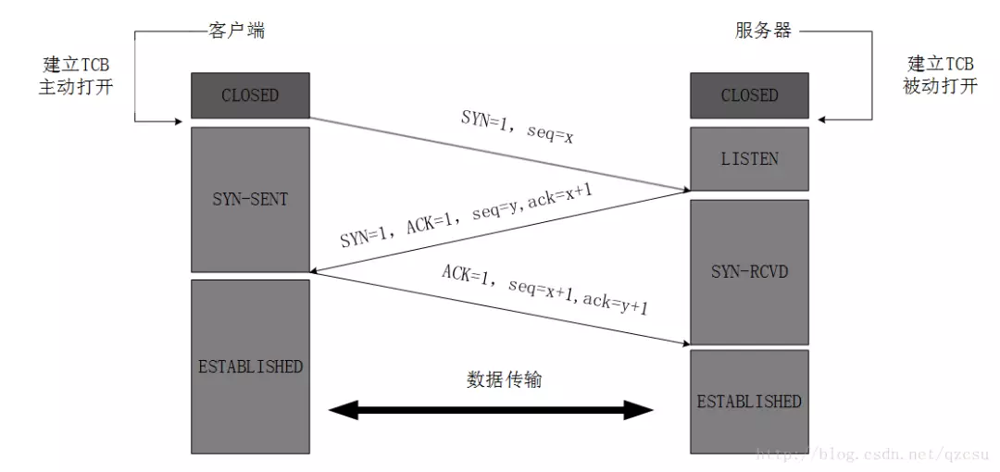
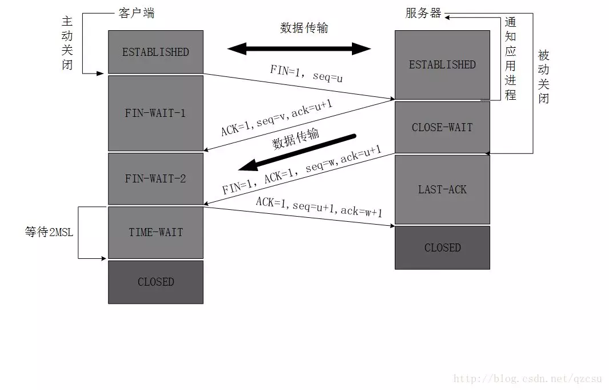

## TCP报头都有哪些字段？各自的功能是什么？

**源端口和目的端口**，各占2个字节，用于寻找发端和收端应用进程。这两个值加上IP首部中的源端IP地址和目的端IP地址唯一确定一个TCP连接。

**序号**，占4个字节，用来标识从TCP发端向TCP收端发送的数据字节流，他表示在这个报文段中的第一个数据字节，TCP连接中传送的字节流中的每个字节都按顺序编号。例如，一段报文的序号字段值是 301 ，而携带的数据共有100字段，显然下一个报文段（如果还有的话）的数据序号应该从401开始；

**确认序号**，占4个字节，是期望收到对方下一个报文的第一个数据字节的序号，应当是上次已成功收到数据字节序号加1。告诉对端确认号之前的数据都已经收到了，接下来可以从确认号开始发送数据

**数据偏移**，占4bit，给出首部中32bit字的数目，任选字段的长度是可变的，TCP最多有60字节的首部

**保留**，占6bit，保留今后使用，但目前应都位0；

**紧急URG**，当URG=1，表明紧急指针字段有效。告诉系统此报文段中有紧急数据；

**确认ACK**，仅当ACK=1时，确认号字段才有效。TCP规定，在连接建立后所有报文的传输都必须把ACK置1；

**推送PSH**，当两个应用进程进行交互式通信时，有时在一端的应用进程希望在键入一个命令后立即就能收到对方的响应，这时候就将PSH=1；

**复位RST**，当RST=1，表明TCP连接中出现严重差错，必须释放连接，然后再重新建立连接；

**同步SYN**，在连接建立时用来同步序号。当SYN=1，ACK=0，表明是连接请求报文，若同意连接，则响应报文中应该使SYN=1，ACK=1；

**终止FIN**，用来释放连接。当FIN=1，表明此报文的发送方的数据已经发送完毕，并且要求释放；

**窗口**，占2字节，进行流量控制，告诉对端接收缓冲区还剩下多少空间可以接收数据

**检验和**，占2字节，校验首部和数据这两部分；

**紧急指针**，占2字节，是一个正的偏移量，和序号字段的值相加表示紧急数据最后一个字节的序号

**选项**，长度可变，定义一些其他的可选的参数。

## TCP链接建立的过程需要三次握手，为什么？

三次握手的过程：

最开始的时候客户端和服务器都是处于CLOSED状态。主动打开连接的为客户端，被动打开连接的是服务器。

客户端向服务器发送一个SYN段，以及一个初始序列号(ISN) seq=x ，请求建立连接，之后状态置位 SYN-SENT。SYN报文段不携带数据，但占用一个序号

服务器收到请求报文后，发出确认报文。确认报文中 ACK=1，SYN=1，确认序号ack=x+1，将确认序号设置为客户端的ISN加1以对客户端的SYN报文段进行确认，同时也要为自己初始化一个序列号 seq=y，此时，服务器进入了SYN-RCVD状态。同样，这个报文也不携带数据

客户端收到确认后，向服务器给出确认。确认报文的ACK=1，确认序号ack=y+1，自己的序列号seq=x+1，客户端必须将确认序号设置为服务器的ISN加1以对服务器的SYN报文段进行确认，此时，TCP连接建立，客户端进入ESTABLISHED状态。

当服务器收到客户端的确认后也进入ESTABLISHED状态，此后双方就可以开始通信了。

----

三次握手主要防止已经失效的连接请求报文突然又传送到了服务器，从而产生错误。

如果使用的是两次握手建立连接，假设有这样一种场景，客户端发送了第一个SYN请求连接，该SYN在网络中被延迟，由于TCP的客户端迟迟没有收到确认报文，以为服务器没有收到，此时重新向服务器发送这条报文，此后客户端和服务器经过两次握手完成连接，传输数据，然后关闭连接。此时此前滞留的那一次SYN请求连接，网络通畅了到达了服务器，这个报文本该是失效的，但是，两次握手的机制将会让客户端和服务器再次建立连接，这将导致不必要的错误和资源的浪费。

如果采用的是三次握手，就算是那一次失效的报文传送过来了，服务端接受到了那条失效报文并且回复了确认报文，但是客户端不会再次发出确认。由于服务器收不到确认，就知道客户端并没有请求连接。

#### TCP链接断开的过程需要四次挥手，为什么？

TCP连接是全双工的，因此每个方向必须单独地关闭。当客户端发送FIN时，表示的是客户端数据发送完毕，没有数据要发送给server端了。  当server发送FIN时，表示的是server数据发送完毕。

客户端进程发出连接释放报文，并且停止发送数据。释放数据报文首部，FIN=1，其序列号为seq=u（等于前面已经传送过来的数据的最后一个字节的序号加1），此时，客户端进入FIN-WAIT-1状态。FIN报文段不携带数据，但占用一个序号

服务器收到连接释放报文，发出**确认报文**，ACK=1，确认序号ack=u+1，并且带上自己的序列号seq=v，此时，服务端就进入了CLOSE-WAIT状态。TCP服务器通知应用层进程，客户端向服务器方向的数据传送终止了，这时候处于半关闭状态，即客户端已经没有数据要发送了，但是服务器若发送数据，客户端依然要接受。这个状态还要持续一段时间，也就是整个CLOSE-WAIT状态持续的时间。

客户端收到服务器的确认请求后，此时，客户端就进入FIN-WAIT-2状态，等待服务器发送连接释放报文（在这之前还需要接受服务器发送的最后的数据）。

服务器将最后的数据发送完毕后，就向客户端发送连**接释放报文**，FIN=1，ack=u+1，由于在半关闭状态，服务器很可能又发送了一些数据，假定此时的序列号为seq=w，此时，服务器就进入了LAST-ACK状态，等待客户端的确认。

客户端收到服务器的连接释放报文后，必须发出确认，ACK=1，确认序号设置为收到的序号加1，ack=w+1，而自己的序列号是seq=u+1，此时，客户端就进入了TIME-WAIT状态。注意此时TCP连接还没有释放，必须经过2MSL（报文段最大生存时间）的时间后，客户端才进入CLOSED状态。

服务器只要收到了客户端发出的确认，立即进入CLOSED状态。

-----

关闭连接时，服务器收到客户端的FIN报文时，仅仅表示客户端不再发送数据了但是还能接收数据，而自己也未必全部数据都发送给对方了，所以服务器可以立即关闭，也可以发送一些数据给客户端后，再发送FIN报文给客户端来表示同意现在关闭连接，因此，服务器ACK和FIN一般都会分开发送，从而导致多了一次。

## 断开连接时，为什么需要有time_wait的状态？该状态可以删除吗？

不可以，

第一，确保连接能够正常断开，确保服务器发送的FIN报文客户端能够收到，并进行确认，确认报文服务器也能收到。服务器的FIN报文和客户端的ACK报文最大生存时间都是MSL。服务器第二次发出FIN报文后，如果没有收到客户端的ACK报文，一定会在2MSL时间内重发FIN报文，客户端就能在这个2MSL时间段内收到这个重传的报文，接着发出ACK报文。

第二，防止数据窜链。第一次建立的连接断开， 有部分数据在网络中延迟，还没有到达对端。第二次建立新连接， ip和port跟第一次建立的连接时一样的。 此时在网络中延迟的数据，到达了客户端，会造成数据数据窜链。客户端发送完最后一个确认报文后，在这个2MSL时间中，就可以使本连接持续的时间内所产生的所有报文段都从网络中消失，这样新的连接中不会出现旧连接的报文。

## 服务器端可以主动断开连接吗？为什么？

 一般情况下，服务器不会主动断开连接，因为主动断开连接的一方，会进入到TIME_WAIT状态， 而该状态要持续2MSL时间，导致服务器资源浪费。

服务器是可以主动断开连接的。 但必须要将网络地址设置为可重用的。

## TCP与UDP的区别是什么？

TCP提供的是面向连接的、可靠的字节流服务，不会丢包，不会乱序，失败会重发

UDP是无连接的协议，不提供可靠性，需要应用层协议来保证可靠性，直播可以用UDP

## 一个进程最多能够打开多少文件描述符? 如何设置？

**用户级别**：默认1024个，先修改`/etc/security/limits.conf`，soft或hard指定要修改软限制还是硬限制，软限制值要小于等于硬限制值，再通过`ulimit -a`设置

**系统级别**：通过`sudo sysctl -a |grep file-max`查看，修改`/ect/sysctl.conf`里的`fs.file-max`

## 网络IO模型有哪些？

阻塞式IO

非阻塞式IO

IO复用(IO multiplexing)

信号驱动式IO

异步IO(POSIX的aio_系列函数)

## 什么是同步、异步？什么是阻塞、非阻塞？

##### 同步/异步

关注的是消息通信机，内核与应用程序的交互　

访问数据的方式，同步需要主动读写数据，在读写数据的过程中还是会阻塞；

异步只需要I/O操作完成的通知，并不主动读写数据，由操作系统内核完成数据的读写。

##### 阻塞/非阻塞

关注的是用户态进程/线程(程序)的状态

其要访问的数据是否就绪，进程/线程是否需要等待

## 网络IO复用模型有哪些？它们之间的异同是什么？

|        | 原理                                                         |
| ------ | ------------------------------------------------------------ |
| select | select本质上是通过设置或者检查存放fd标志位的数据结构来进行下一步处理。这样所带来的缺点是：1 单个进程可监视的fd数量被限制；2 需要维护一个用来存放大量fd的数据结构，这样会使得用户空间和内核空间在传递该结构时复制开销大；3 对socket进行扫描时是线性扫描 |
| poll   | poll本质上和select没有区别，它将用户传入的数组拷贝到内核空间，然后查询每个fd对应的设备状态，如果设备就绪则在设备等待队列中加入一项并继续遍历，如果遍历完所有fd后没有发现就绪设备，则挂起当前进程，直到设备就绪或者主动超时，被唤醒后它又要再次遍历fd。这个过程经历了多次无谓的遍历。**它没有最大连接数的限制，原因是它是基于链表来存储的**，但是同样有一个缺点：大量的fd的数组被整体复制于用户态和内核地址空间之间，而不管这样的复制是不是有意义。poll还有一个特点是“水平触发LT”，如果报告了fd后，没有被处理，那么下次poll时会再次报告该fd。 |
| epoll  | 水平触发LT,  一旦一个文件描述符上发生了事件，只要不处理，每次都会返回。边缘触发ET，只有第一次返回时会需要进行处理， 但如果没有处理， 之后再也不会返回，这种方式提高了编程的复杂程度，还有一个特点是，epoll使用“事件”的就绪通知方式，通过epoll_ctl注册fd，一旦该fd就绪，内核就会采用类似callback的回调机制来激活该fd，epoll_wait便可以收到通知 |

#### select和epoll区别

- select可以监控的文件描述符数目是固定的,默认1024. epoll没有这个限制,可监控文件描述符的上限是最大可以打开文件的数目,在1GB内存的机器上大约是10万左右，具体数目可以cat /proc/sys/fs/file-max察看,一般来说这个数目和系统内存关系很大.
- 每次调用select，都需要把fd集合从用户态拷贝到内核态，在fd很多时开销会很大;  epoll的解决方案是在epoll_ctl函数中。每次注册新的事件到epoll句柄中时，会把所有的fd拷贝进内核，而不是在epoll_wait的时候重复拷贝,poll保证了每个fd在整个过程中只会拷贝一次。
- 同时每次调用select都需要在内核遍历传递进来的所有fd, 判断有没有就绪的fd, 这个开销在fd很多时也很大;  epoll只会对就绪的fd进行操作,在调用epoll_ctl添加新的fd时, 为每个fd指定一个回调函数, 当fd就绪时,就会调用这个回调函数，而这个回调函数会把就绪的fd加入一个就绪链表, epoll_wait只需要判断这个就绪链表是否为空就行了.
- select所监控的fd_set在select()返回之后会发生变化,下一次进入select()之前都需要重新初始化需要监控的fd_set
- select()的超时参数在返回时也是未定义的,每次在超时之后下一次进入select之前都需要重新设置超时参数
- epoll既支持水平触发也支持边沿触发.与之相反,select和poll只支持水平触发,而信号驱动I/O只支持水平触发.

#### epoll的水平模式和边缘模式

以 socket 的读事件为例，对于水平模式，只要 socket 上有未读完的数据，就会一直产生 POLLIN 事件；而对于边缘模式，socket 上每新来一次数据就会触发一次，如果上一次触发后，未将 socket 上的数据读完，也不会再触发，除非再新来一次数据。

对于 socket 写事件, 对于水平模式, 如果 socket 的 TCP 窗口一直不饱和，会一直触发 POLLOUT 事件；而对于边缘模式，只会触发一次，除非 TCP 窗口由不饱和变成饱和再一次变成不饱和，才会再次触发 POLLOUT 事件.

也就是说，如果对于一个非阻塞 socket，如果使用 epoll 边缘模式去检测数据是否可读，触发可读事件以后，一定要一次性把 socket 上的数据收取干净才行，也就是说一定要循环调用 recv 函数直到 recv 出错，错误码是EWOULDBLOCK（EAGAIN 一样）（此时表示 socket 上本次数据已经读完）；如果使用水平模式，则不用，你可以根据业务一次性收取固定的字节数，或者收完为止。

ET模式在很大程度上减少了epoll事件被重复触发的次数，因此效率要比LT模式高。epoll工作在ET模式的时候，必须使用非阻塞模式，以避免由于一个文件描述符的阻塞读/阻塞写操作把处理多个文件描述符的任务饿死

## 什么是Reactor，Proactor模式？各自的特点是什么？

##### Reactor模式

又叫反应器模式，应用于同步I/O的场景。

读取操作：

1.  应用程序注册读就绪事件和相关联的事件处理器
2.  事件分离器等待事件的发生
3.  当发生读就绪事件的时候，事件分离器调用第一步注册的事件处理器
4.  事件处理器首先执行实际的读取操作，然后根据读取到的内容进行进一步的处理

##### Proactor模式

前摄器模式，基于异步IO

读取操作：

1. 应用程序初始化一个异步读取操作，然后注册相应的事件处理器，此时事件处理器不关注读取就绪事件，而是关注读取完成事件，这是区别于Reactor的关键。
2. 事件分离器等待读取操作完成事件
3. 在事件分离器等待读取操作完成的时候，操作系统调用内核线程完成读取操作，并将读取的内容放入用户传递过来的缓存区中。这也是区别于Reactor的一点，Proactor中，应用程序需要传递缓存区。
4.  事件分离器捕获到读取完成事件后，激活应用程序注册的事件处理器，事件处理器直接从缓存区读取数据，而不需要进行实际的读取操作。

Reactor和Proactor模式的主要区别：真正的读取和写入操作是由谁来完成的：

Reactor中需要应用(用户)程序自己读取或者写入数据

Proactor模式中，应用程序不需要进行实际的读写过程，它只需要从缓存区读取或者写入即可，内核会读取缓存区或者写入缓存区到真正的IO设备